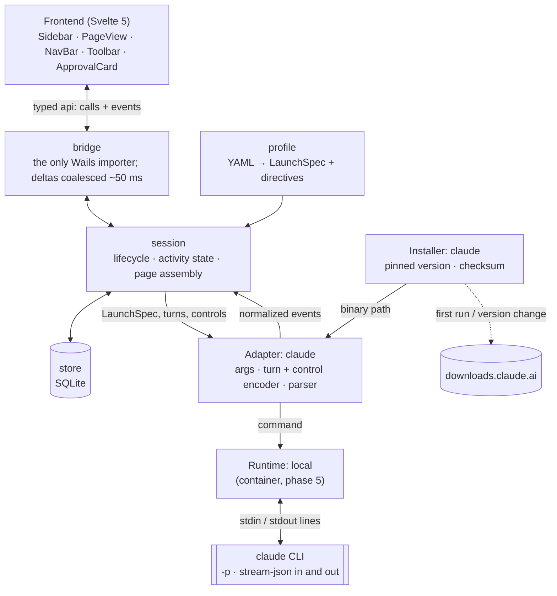

# UNCLI — Phased Build Brief

Oct 1, 2026 · @Harvey Poppington

> **Handover file, frozen 2026-10-04.** This brief was the initial handover and is no longer updated. The current design of each feature lives on its BRUV card, architecture-shaping choices in `docs/decisions/`, and further planning in new files (amendments or feature designs).

## Purpose and scope

UNCLI (pronounced "un-clee") is a desktop GUI layer over AI CLIs, starting with Claude Code, so you can run many Claude sessions without a terminal. The name reads as "un-CLI", the command line without the command line, and sits beside BRUV as a family. Domain: uncli.app. In code, packages and binaries use lowercase `uncli`.

**What UNCLI is:** a multi-session manager, a paged conversation reader, an approval surface for tool permissions, and a launcher into the user's real tools.

**What UNCLI is not:** an IDE, editor, diff viewer or git client. When work turns into coding, UNCLI links into the user's IDE at the right file and line, and stops there.

**Backend rule: pure CLI for sessions.** A session's model (chat, co-work, coding) only ever runs through its CLI: every session is a long-lived CLI process driven over stdin/stdout, never a direct model API call. This keeps subscription billing, where the monthly allowance matters most, gives sessions one code path, and makes other providers (Gemini CLI, Codex CLI) a matter of adding adapters. **Helper models are app-level** (decision record 0006): the quick-task model and the decision model belong to the app, not to a session, are shared by every session (CLI-backed or not), and may run through a CLI or call an API directly with their own credentials, because they are cheap at API prices. Today the quick-task model runs through the session provider's CLI (`TextTasker`); an API-backed helper is allowed. CLI credentials are never reused outside the official binary.

**Design rule: one of each, seams for all.** Phase 1 ships exactly one implementation of each core interface (one adapter with its installer, one runtime, three built-in profiles). Every later feature in this brief must land as a new implementation or a new config file, never as a rewrite of the core. If a phase needs a core change, the architecture section was wrong; fix the brief first.

**Modes:** Chat (no project, scratch folder, artifacts), Co-work (a user folder of documents, artifacts) and Code (a repo, full tools, IDE links). Modes are profiles, not code paths.

## Stack and repo layout

Go + Wails + Svelte 5 + TypeScript, the same stack as BRUV, with SQLite for app state. Use Wails v2 unless v3 is stable at build time; keep Wails-specific code in one package so the switch is cheap.

| Layer | Choice | Why |
| --- | --- | --- |
| Backend | Go 1.23+ | Subprocess and stream handling, fsnotify, Docker SDK later |
| Shell | Wails | Native window, Go-to-JS bindings and events |
| UI | Svelte 5 + TypeScript | Runes for streaming state; shared look with BRUV |
| Markdown | markdown-it + Shiki | Source line maps (copy original markdown), good highlighting |
| Storage | SQLite via modernc.org/sqlite | Pure Go, no cgo, cross-compiles cleanly |
| Config | YAML files | Profiles and modifiers are user-editable data |
| Icons | Lucide | Matches the toolbar and modifier icon names |

```
app/                      # the Go module (the repo root holds docs, website, scripts)
  main.go                 # Wails bootstrap only
  internal/
    core/                 # interfaces + normalized events (no deps on anything else)
    adapter/claude/       # Claude Code CLI: installer, arg builder, encoders, stream-json parser
    runtime/local/        # local process runtime
    runtime/container/    # (phase 5)
    session/              # session lifecycle, turn assembly, state machine
    app/                  # wiring, CLI install and sign-in, event coalescing (no Wails)
    integration/          # end-to-end tests against the real CLI (build tag)
    store/                # SQLite: sessions, pages, bookmarks, usage
    profile/              # profile + modifier loading and resolution
    attach/               # dropped and pasted files: what can be attached, size limits, reading
    clipfiles/            # the OS clipboard's file list (files copied in Explorer)
    watch/                # fsnotify: artifacts dir, touched files (phase 2)
    ide/                  # open-in-editor launchers (phase 2)
    bridge/               # the ONLY package that imports Wails
  config/defaults/        # built-in profiles.yaml, modifiers.yaml, toolbar.yaml
  frontend/src/
    lib/api/              # typed wrapper over bridge calls + event subscription
    lib/render/           # markdown-it setup, copy-block plugin, Shiki
    components/           # Sidebar, PageView, NavBar, Toolbar, ApprovalCard, ArtifactPane
    stores/               # sessions, pages, activity
  testdata/streams/       # recorded CLI streams: <provider>/<cli version>/*.jsonl
```

`app` holds everything the bridge exposes but nothing Wails-specific, so it is unit-tested and a server-mode bridge (phase 6) can reuse it. There is no `permission/` package: the spike showed approvals can travel over the CLI's own stdio control protocol (see Spike findings), so the adapter handles them.

The rule that keeps the kitchen sink possible: `core` imports nothing internal, and only `bridge` imports Wails. If UNCLI ever runs as a local server for a docked or remote UI, `bridge` is the only package replaced.

## Architecture

A session is an adapter (which CLI) running on a runtime (where it runs), configured by a profile plus modifiers, emitting normalized events that the session assembles into pages. The UI only ever sees UNCLI's own events and pages, never a provider's raw output.



Everything above the CLI process is UNCLI's; swapping the adapter, installer or runtime box is how phases 5 and 6 land. Approvals (phase 2) travel over the same stdio pipe as control requests, so there is no separate permission server.

### Core interfaces (`internal/core`)

```go
// Adapter: one per CLI provider. Phase 1: claude.
type Adapter interface {
    ID() string
    Capabilities() Capabilities
    Installer() Installer
    BuildCommand(bin string, spec LaunchSpec) (Command, error) // args, env
    AuthStatusCommand(bin string) Command                      // e.g. claude auth status
    ParseAuthStatus(out []byte) (AuthInfo, error)
    LoginCommand(bin string) Command                           // the provider's sign-in; reads a pasted code on stdin
    LoginURL(output []byte) (string, bool)                     // the sign-in link it printed, once it has
    EncodeTurn(t UserTurn) ([]byte, error)                     // one stdin line
    EncodeControl(c Control) ([]byte, bool)                    // interrupt, set model, approval answer; false = unsupported
    NewParser() Parser                                         // stateful, one per process
}

// Installer: UNCLI downloads and pins each CLI itself, so a CLI update
// on the user's machine never breaks UNCLI. Each UNCLI release names the
// CLI version it was tested against; the user may advance it at their own risk.
type Installer interface {
    Pinned() string                                   // version this UNCLI build is tested with
    Installed() ([]string, error)                     // versions in UNCLI's own cache
    Path(version string) (bin string, ok bool)        // an installed binary, if present
    Ensure(ctx context.Context, version string, progress func(done, total int64)) (bin string, err error)
    Channels(ctx context.Context) (map[string]string, error) // e.g. stable, latest -> version
}

type Parser interface {
    Feed(line []byte) ([]Event, error) // unknown event types -> EvUnknown, never an error
}

// TextTasker: an adapter that can run one-off text tasks (page summaries,
// later things like commit messages) outside any session: no tools, no
// history, one answer, optionally JSON matching a schema. The user picks
// one provider and model for all of them ("quick tasks").
type TextTasker interface {
    TextTaskCommand(bin string, t TextTask) Command // the prompt goes on stdin
    ParseTextTask(out []byte) (TextResult, error)
}

// Decider: an app-level helper that answers fixed-answer questions about a
// state, with a probability for each answer (decision record 0006). The
// default is the quick-task model asked for structured output
// (uncalibrated); a calibrated decider (Jev, Kev) is planned.
type Decider interface {
    Info() DeciderInfo                                   // id, model, pinned version, calibrated
    Decide(ctx context.Context, d Decision) (Decided, error) // state + questions -> an answer and probability each
}

// TranscriptReader (phase 3, optional): an adapter that can list the
// conversations its CLI has saved and convert one into UNCLI pages, so a
// conversation from the terminal (or a deleted UNCLI session) can be
// opened and continued. Each CLI keeps transcripts in its own place and
// format; the runtime says where to look (the user's home locally, a
// volume in a container), so the reader never assumes a path.
type TranscriptReader interface {
    ListTranscripts(loc TranscriptLocation) ([]TranscriptInfo, error) // id, workdir, started, first question
    ReadTranscript(loc TranscriptLocation, id string) (Transcript, error) // provider-neutral turns
}

// Runtime: where the process lives. Phase 1: local. Phase 5: container.
type Runtime interface {
    ID() string
    Start(ctx context.Context, cmd Command, workdir string) (Proc, error)
}

type Proc interface {
    Stdin() io.Writer
    Stdout() io.Reader
    Stderr() io.Reader
    Wait() error
    Kill() error
}

// LaunchSpec: everything resolved from profile + model + system-scope modifiers.
type LaunchSpec struct {
    SessionID       string            // provider session id chosen by UNCLI for a new conversation
    ResumeID        string            // provider session id to resume; empty = new
    Model           string
    Effort          string            // low | medium | high | xhigh | max; empty = CLI default
    Workdir         string
    SystemPrompt    string            // replace (chat profile)
    AppendPrompt    string            // append (code, co-work)
    Tools           []string          // tools that exist at all; nil = CLI default set
    AllowedTools    []string          // tools pre-approved without a prompt
    DisallowedTools []string
    PermissionMode  string            // default | acceptEdits | dontAsk | plan; never bypass
    Approvals       bool              // phase 2: route prompts to UNCLI; false = deny automatically
    Isolated        bool              // ignore user settings, MCP servers and skills (chat)
    MCPConfig       []string          // extra MCP server config files (--mcp-config)
    Env             map[string]string
}

type UserTurn struct {
    Text        string
    Directives  string       // rendered turn-scope modifiers, hidden in the UI
    Attachments []Attachment // files sent with the turn: images, PDFs, text (Images / Documents capabilities)
}

type Attachment struct {
    Name      string // the document title the model sees
    Path      string // where it came from; empty for pasted data
    MediaType string // image/png|jpeg|gif|webp, application/pdf, text/plain
    Data      []byte
}
```

### Components

**Profile resolver** (`profile`). Merges built-in YAML with user overrides by `id`. Takes a profile, a model and the active modifiers; returns a `LaunchSpec` (from system-scope modifiers) and a directive renderer (for turn-scope modifiers). Per-model modifier text is matched by family glob (`opus*`), falling back to `default`.

**Session** (`session`). Owns one process at a time. Runs a reader goroutine that feeds stdout lines to the parser, updates the activity state machine, assembles pages and writes them to the store. A new session gets its provider session id from UNCLI (`--session-id`), and the session updates it whenever the CLI reports a different one (`/clear` starts a new conversation with a new id). Model switches use a control message when the adapter reports `LiveModelSwitch` (Claude does). System-scope changes, and model switches on adapters without a live switch, trigger a **respawn**: wait for idle (or queue the change), kill, relaunch with `ResumeID`. Respawns always reuse the session's workdir, because the CLI files transcripts by working directory.

**Installer** (`adapter/claude`, behind `core.Installer`). Downloads the pinned CLI version into UNCLI's cache dir (`<user cache>/uncli/cli/claude/<version>/`), never touching the user's own install. For Claude it reads `https://downloads.claude.ai/claude-code-releases/<version>/manifest.json`, downloads `<version>/<platform>/claude(.exe)` and checks its SHA-256 against the manifest before use. Each UNCLI release pins one version; a setting lets the user pick a newer one (from the `stable` or `latest` channel) at their own risk, with a one-click return to the pinned version. The download is about 240 MB, so first run shows progress. The CLI's own auto-updater is disabled in the environment UNCLI passes.

**Sign-in.** Before the first session, UNCLI runs the adapter's auth status command (`claude auth status` prints JSON with `loggedIn`). If signed out, the sign-in screen runs `claude auth login --claudeai` with a stdin pipe. Without a terminal the CLI uses its paste-the-code flow: it prints a link and waits for a code. Its own attempt to open the browser fails from a windowless app, so UNCLI opens the link in the default browser itself (with "open again" and "copy link" fallbacks), takes the code the page shows, writes it to the CLI's stdin, and then decides the outcome from `auth status`, because the CLI's own output can't be trusted (see Spike findings). The status check allows 60 s and one retry: the first run of a freshly downloaded binary can be slow while antivirus scans it. A turn that fails with `authentication_failed` returns the user to that screen.

**Quick tasks** (`app`). Small text jobs that don't belong in a conversation go to the app-level quick-task model, shared by every session. Today that is a separate one-off CLI call through the chosen provider's `TextTasker`; an API-backed tasker (with its own key) may serve it instead (see Backend rule). For Claude that's `claude -p --output-format json --no-session-persistence --tools "" --strict-mcp-config --setting-sources "" --disable-slash-commands`, with the prompt on stdin and `--json-schema` when a structured answer is wanted (it arrives as `structured_output`). One preference, `quickTaskModel` ({provider, model}, default Claude Haiku), covers every such task, so a light or local model (a Qwen behind its own CLI adapter, say) can take them all. The first task is the page summary: the UI numbers the answer's top-level markdown blocks (code blocks described, not quoted), the model returns `{block, title, kind}` sections, UNCLI keeps the ones that point at real blocks in order and stores them on the page (`pages.outline`, added by migration), so a page is summarised once. `kind` is one of ten section kinds (overview, commentary, analysis, steps, code, data, example, tip, warning, conclusion), enforced by the schema; the outline shows an icon for each. Plain headings get a kind from a local guess (heading words, then whether code, tables or numbered lists dominate the section), which costs nothing; a summary's kinds come from the model. The Go and TypeScript lists are checked against each other by a test. Summaries run on request from the outline panel, or automatically as an answer finishes, per the `autoSummary` preference: `off` (the default), `long` (150+ words, headings or not) or `always` (any answer of more than one block). The result is the same as on request; an answer passed over for being short says so in the outline ("Short answer, not summarised", with a link to summarise it anyway). A short answer costs about $0.005–0.01 on Haiku.

**Process environment.** UNCLI builds the child's environment explicitly: it inherits the user's environment minus `CLAUDE_CODE_*`, `CLAUDECODE`, `CLAUDE_EFFORT`, `CLAUDE_PID` and `CLAUDE_AGENT_SDK*` (UNCLI may itself be launched from inside a Claude session, whose session ids and effort setting would otherwise leak into every child), plus `DISABLE_AUTOUPDATER=1`. It also drops `NODE_OPTIONS`, `NODE_INSPECT*`, `VSCODE_INSPECTOR_OPTIONS` and `BUN_INSPECT*`: the CLI runs on a JavaScript runtime, and VS Code's debugger auto-attach puts `NODE_OPTIONS=--require …/js-debug/bootloader.js` into every terminal, with which every CLI command exits 1 and prints nothing. `CLAUDE_CONFIG_DIR` and API keys pass through: they are the user's choice.

**Store** (`store`). SQLite for sessions, pages, bookmarks, usage and the raw event log. The provider's own transcript remains the source of truth for conversation content; UNCLI's store holds structure, metadata and a replayable copy.

**Bridge** (`bridge`). The only Wails importer. Exposes bound methods (create session, send turn, switch model, toggle modifier, answer approval, open in IDE) and emits per-session events to the frontend, with text deltas coalesced to about every 50 ms.

**Approvals** (adapter, phase 2). With `--permission-prompt-tool stdio`, the CLI writes a `control_request` with subtype `can_use_tool` (tool name, input, a description and permission suggestions) to stdout and waits for a `control_response` on stdin with `behavior: allow` (plus `updatedInput`) or `behavior: deny` (plus a message). The parser turns the request into `EvApprovalAsked`, and the answer goes back through `EncodeControl`. No local server, port or token is involved, so there is nothing for a web page to reach. The session shows Needs approval until the UI answers.

The session answers requests without a card when it can (see When to prompt below). A command line is read part by part by UNCLI's own reader (`session/script.go`), for bash and PowerShell alike; the dialect comes from the tool use, not from the computer UNCLI runs on, so the same rules hold on macOS and Linux, where Claude uses bash. The reader splits at pipes and chains (`|`, `||`, `&&`, `;`) outside quotes; reads `$( )`, backticks, `{ }` and `( )` blocks recursively; treats heredocs, assignments, keywords (`if`, `foreach`, `exit`…), in-line functions and PowerShell hashtables as structure; looks through wrappers (`timeout`, `env`, `xargs`, the PowerShell call operator `&`); expands variables it saw assigned; follows `cd` so later parts know their folder; and drops harmless redirects (`2>&1`, `2>$null`, `>/dev/null`) and output filters (`head`, `grep`, `Select-Object`, `ForEach-Object`…). Every other part is judged on its own, so `git status && rm -rf .` never rides on `git status`. What it can't read reliably prompts. Stopping a turn denies anything still waiting before it interrupts. The trace records who let each asked-for call run (`approved`: you, your safe list, the session type, judged safe, only reading, Never, or `mixed`) and the reason for each part (`why`); a failed call shows its exit code and the line that says what went wrong, with its full output on request.

**Provider seam for tool uses** (`core.ToolAction`). The session never reads a provider's tool names or inputs. An adapter turns each request into a `ToolAction`: a kind (`shell`, `read`, `search`, `write`, `edit`, `web`, `mcp`, `question`, `plan`, `agent`, `internal`, `other`), the tool's name, and for a shell its dialect (`bash` or `powershell`) and command, or for a file tool its path. Claude's mapping is `claude.ActionOf`; another CLI adds its own table. An adapter may also implement `core.StatePather` to name the CLI's own state folders, where writes are harmless (Claude: `plans`, `projects` and `todos` under `~/.claude` or `CLAUDE_CONFIG_DIR`), so a plan file never counts as writing outside the project.

**Unattended mode** (landed 2026-10-03; `session/approvals.go`). A per-session switch in the session header, for when the user walks away and wants the work to keep going: Claude is never prompted for, but anything that would have prompted is declined at once, with a message telling the model the user is away, not to retry, to use what runs without prompting, to run chained or piped commands as separate commands and to list what still needs the user at the end of its answer. `AskUserQuestion` is declined with "make the most reasonable choice and say which", and `ExitPlanMode` with "give the plan and stop". Turning it on declines any card already waiting. The model is told at the start of the next turn, as a line in `<session_directives>`, when the mode changes (on, then off once when it's switched back); the told state only advances once a turn is actually sent. Declined requests are marked denied in the trace, with the reason. The switch is in memory on the UNCLI session, so it's off after a restart. It is not the CLI's bypass mode: the CLI still asks UNCLI about every tool use outside its allowlist. Always plus Unattended is the old Read-only: reading runs, everything else is declined.

**When to prompt** (landed 2026-10-04, redesigned the same day; `session/modes.go`, `risk.go`, `class.go`, decision records 0004 and 0005). The header reads **Prompt me: Always · When unsafe · Never**. Switching applies to the next request and to any card already waiting (each is judged again, as it is when the safe list or Unattended changes).

| | Reading | Safe | Unsafe | Can't tell |
|---|---|---|---|---|
| Always | runs | prompts | prompts | prompts |
| When unsafe (default) | runs | runs | prompts | the user's setting |
| Never | runs | runs | runs | runs |

Blocked entries never run, at any level; questions and plans always go to the user. Under Always the CLI is switched to its `default` permission mode (`set_permission_mode`, live) so edits reach UNCLI; otherwise it runs in the profile's own mode. Never is never the CLI's bypass mode: the CLI still asks UNCLI. A shell command is judged part by part: it runs only when every part would, and one blocked part blocks it. The model is told the level in `<session_directives>` when it changes, and once on the first turn after a session is restored, each time with a note that there is no read-only restriction; without it, a conversation told it was read-only by the old mode kept refusing to try tools (found 2026-10-04).

**Risk** (`session/risk.go`). Each tool use, or each working part of a command, is:

- **reading**: `ls`, `cat`, `Get-*`, read-only git, output filters, Read, Grep, Glob, WebSearch, WebFetch. Reading the web counts as reading.
- **safe**: work inside the session's folder that can be undone or redone: file edits there, builds, tests, linters and formatters, package scripts and local installs, the project's own scripts run by an interpreter (`python tools/gen.py`), local git (add, commit, switch, pull, merge, tag), single-file deletes and deletes of generated folders (`node_modules`, `dist`, `build`…) or temp files, PowerShell `Set-`/`New-`/`Copy-`/`Move-` verbs.
- **unsafe**, with a plain reason: `deletes` (recursive or wildcard deletes, `git reset --hard`, `git clean`, `find -delete`), `discards` (`git checkout -- file`, `git restore`, `git checkout name`, which may be a file), `outside` (a change naming a path outside the folder, the temp and CLI state folders excepted), `publishes` (sending or publishing beyond this computer: git push, npm/cargo publish, docker push, uploads and POSTs, `gh` changes, MCP tools that write and reach outside), `installs` (global installs, pip, OS package managers), `system` (admin, registry, services), `stops` (kill, `Stop-*`), `remote` (ssh, scp), `secrets` (`.ssh`, `.aws`, credentials, `.env` files but not `.env.example`), `runs-code` (`iex`, an interpreter fed by a pipe), `cloud` (kubectl, terraform, az… except reads), `unsure` (a calibrated decision model wasn't sure enough that it's safe).
- **can't tell**: anything else, including code passed inline (`node -e`, `python -c`) and MCP tools whose server gave no annotations (the CLI drops false hints, so silence can't be told from "harmless").

A risk comes either from the **program** (`git push` publishes wherever it runs) or from the **context** (this `cp` writes outside the folder, this `cat` reads a secret). Only program risks can be corrected by the user.

**Defaults for every stack** (landed 2026-10-04; BRUV "Stack-neutral defaults"). The defaults assume no stack: a project in any common stack (JavaScript/TypeScript, Python, Go, Rust, Java/Kotlin, .NET, Ruby, PHP, Swift, Dart/Flutter, C/C++, Elixir, containers) runs its usual build, test, lint, format, run and dependency commands without prompting, and prompts before publishing, deploying or installing outside the project, with no setup. The rule is stack-neutral (`toolchain`, `publishing` in `risk.go`): for any build tool, package manager or task runner, a subcommand, task, goal or script whose name is made of `publish`, `deploy`, `release`, `upload`, `unpublish`, `yank` or `push` (split at `:` and `.`, so `gradle :app:publish`, `mix hex.publish`, `npm run deploy:prod` and also `npm run build:release` count; files such as `deploy.js` don't), or a `--publish`, `--deploy` or `--push` option, publishes. "release" as an option's value (`-c release`) is a build configuration, `publishToMavenLocal` stays local, and `dotnet publish` only builds. `make install`, `cmake --install`, `composer global` and `gem install` install outside the project; `uv`, `poetry`, `pipenv`, `pdm`, `hatch` and `bundle` work in the project's own environment and are safe, while `pip install` (which may be the system Python) and `conda install` still prompt. Generated folders cover the same stacks (`.venv`, `vendor`, `Pods`, `.dart_tool`, `_build`, `deps`, `cmake-build-*`, `*.egg-info`…). A toolchain's class is its task (`mvn deploy`, `gradle test`), with a `--publish` flag when the words don't show the publishing, so an entry for the tool never covers it. The Code profile's built-in list holds only read-only git: an entry there overrides the judgement, so `Bash(npm run:*)` let `npm run deploy` run unprompted. `TestRiskCorpus` covers every listed stack in about 240 commands; replaying other stacks' real transcripts is still to do (Harvey's history is all Go and JavaScript).

**What "can't tell" does** is a preference (`unknownCommands`, Settings): `model` (default, "Let the decision model decide"): the app's **decision model** (`core.Decider`, `app/decide.go`) judges it by answering two questions, what it does (reading / safe / unsafe) and, if unsafe, how, plus a one-line reason for a non-technical reader when the decider can write one. The decision model is a preference of its own (`decisionModel`: provider, endpoint, model, pinned version, local-only, threshold), the quick-task model by default ("Use the quick-task model for decisions": two roles, one model); it is uncalibrated, so its answers are taken as given. The other provider is a **System One server** (`app/systemone.go`): hosted Jev, or a self-hosted Kev, which serves the same `POST /v1/systemone` contract. Each question goes as a `choice` question with its choices as criteria, and the probability of the chosen answer is its confidence; it writes no reason, so the card says the risk in plain words. Written from Kev's README and tested against a fake server; not yet tried against a live one. Its API key is kept apart from the preferences (`settings` key `decisionModel.apiKey`, never sent to the UI; an OS keychain is the better home later), "local only" refuses addresses that aren't loopback, private, a tailnet or a local name, and Settings → Decision model has a **Test** button that asks about `npm test` and shows the answer, how sure, how long it took and which decider answered. A calibrated decider must be at least `threshold` sure (default 0.9) that something reads or is safe; below that it counts as unsafe, "not sure" (`unsure`), and prompts. Answers are cached in `risk_judgements` by class (below) with the decider's key and the confidence, so `mytool sync --a` and `mytool sync --b` are judged once, and switching decision models judges again; meanwhile the request waits without a card (the pane shows "Checking whether a command is safe to run…"), and if the model fails the user is prompted. `inside` ("Treat it as safe if it stays in this folder"). `ask` ("Treat it as unsafe and prompt me"). Quick tasks run in an empty folder of their own (`<cache>/quick-tasks`), so a judgement or summary never reads a project's `CLAUDE.md` or memory.

**The safe list** (`store/safe.go`, table `safe_list`). The user's corrections to what counts as safe. Each entry is a **class** (a command class or a tool), a **verdict** (Safe, Unsafe or Blocked) and a **scope** (This project, the session's folder, or All projects). User entries beat the built-in tables and the model; the most specific matching entry wins, and on a tie This project beats All projects. An entry covers a part when its words are a prefix of the part's class words; a Safe entry also needs every risk flag the part has, so `npm` marked Safe covers every npm command except the risky-flag variants, while a Blocked or Unsafe `git push` covers `git push --force` too. The session type's `allowed_tools` stay as a read-only built-in list ("Safe in Code sessions"); an Unsafe or Blocked entry still wins over it. The list replaced the per-project rules, session rules and per-tool classes; a migration turned old rules into entries (allow → Safe, ask → Unsafe, deny → Blocked, This project) and old tool classes into All-projects entries.

**A command's class** (`classOf`) is its identity without what varies from run to run: the program (path and `.exe` dropped, lower case, global options such as `--prefix dir` or `-C dir` skipped); subcommand words for programs that have them (npm, pnpm and yarn `run` keep the script, so `npm run lint` isn't `npm run deploy`; git, go, cargo, dotnet, docker, kubectl, terraform, cloud CLIs, OS package managers and system tools such as `reg` and `sc` take one word; `gh` two); for an interpreter, the script (`python tools/gen.py`) or module (`python -m pytest`); for deletes, kills and `ssh`/`scp`, their targets (`rm node_modules`, `ssh me@server`), so marking one delete safe doesn't cover every recursive delete; and **risk flags** that change what it does (`git push --force`, `git reset --hard`, `git checkout --discard`, `npm install --global`, `rm -f -r`, `curl --send`, `find -delete`). Files, messages, filters and other options are dropped. No class can be learned for inline code, for a part too complex to read, for a delete whose target is only known when it runs (`rm -rf $OUT`), or for a context risk; the card then says why and offers Allow once and Deny only. A non-shell tool's class is its name.

**Cards.** A card leads with why Claude is asking, in plain words (the model's reason when it judged, the risk otherwise, or "You marked this unsafe"), then the command. Buttons: **Allow once**, **This is safe** with a **Scope** choice (This project / All projects; the last scope used is remembered per viewer, This project the first time) and **Deny**. A line under them names exactly what will be remembered ("Will remember as safe: `git push` (any files and options)"); a chained command teaches every unsafe part's class in one click. Teaching re-judges every waiting card, so others it covers are answered too. Under Always there is no "This is safe": the card says "You asked to be prompted before anything except reading".

**Teaching from the trace.** A trace row's reason label opens the reason for each part. A part that ran because UNCLI judged it safe (or the session type allowed it, or the setting let it run) offers **This should prompt**, which marks its class Unsafe with the same scope choice. Learning goes both ways.

**Settings → Safe and unsafe.** The header's shield opens Settings here. One list for the current project and all projects, filtered by Everything / This project / All projects / Built in, with each entry's verdict and scope changed in place (moving an entry to All projects promotes it and merges duplicates) and a remove button; **Add** takes an example command (or a tool name, offered from the session's known tools) and shows the class it becomes before saving; **Check a command** runs the session's judgement on a typed command without running it (`ExplainCommand`), giving runs / prompts / blocked and the reason for each part; and the "can't tell" setting.

**Measuring it.** `TestReplayPrompts` (dev only; `UNCLI_REPLAY_TRANSCRIPTS` or `UNCLI_REPLAY_DB`) replays real tool uses from Claude Code transcripts or a UNCLI database against each level. On 7,587 real tool uses, When unsafe prompts for 18.6% when what it can't tell prompts (12% after teaching each class once) and 3.5% when it is treated as safe inside the folder (2% after teaching); Always prompts for 55%, Never for 0.2% (questions and plans). `TestRiskCorpus` (committed) pins about 240 representative commands, bash and PowerShell, to their expected outcome and class.

**Attachments** (`attach`, `clipfiles`). Files dropped on the message box, or pasted there after copying them in Explorer, attach to the next turn. The UI sends paths, and Go reads the files, so large files never cross the bridge. A pasted image with no file behind it (a screenshot) travels as base64 data. Images (PNG, JPEG, GIF, WebP, up to 5 MB) become `image` blocks. PDFs (up to 32 MB) and UTF-8 text files with no NUL bytes (up to 512 KB) become `document` blocks titled with the file name: base64 for PDFs, a text source for text. Folders, other binaries and oversized files can't be attached; the UI inserts their path instead and says why. A page stores what was attached (name, path, media type, size) but not the content, which lives in the CLI's transcript. Explorer copies reach the page only as file names, so the paths come from the OS clipboard's file list (`CF_HDROP` on Windows; macOS and Linux to follow). On Windows, Wails delivers dropped files through the WebView's own drop events, so `DisableWebViewDrop` must stay off; the page cancels file drags itself so a drop can't navigate the window.

**Watchers** (`watch`). fsnotify on each session's artifacts folder (chat and co-work) and, for code sessions, the repo (debounced, ignore-listed). Watchers feed the artifact pane and the touched-files list.

**IDE launcher** (`ide`). Configurable command templates such as `code -g {file}:{line}`, with presets for VS Code, Cursor and Antigravity.

### Data flow for one turn

1. UI calls `SendTurn(sessionID, text)`. The session renders the directives, creates a page row (question plus active model and modifiers) and writes `EncodeTurn` to stdin.
2. The reader goroutine parses stdout into events. Each event goes to the raw log, updates the activity state and is appended to the open page.
3. The bridge emits events to the UI, coalescing deltas.
4. A `TurnResult` event closes the page, records usage and sets Unread if the session isn't focused. Token usage on the result is per turn, but the cost is cumulative for the process, so the page's cost is the difference from the previous result on the same process (and the full value after a respawn).

## Events and capabilities

The normalized event model is the most important contract in UNCLI: get it right in phase 1 and every later adapter, runtime and UI feature plugs into it.

```go
type EventKind string

const (
    EvSessionReady  EventKind = "session_ready"   // provider session id, model, tools (also when the id changes)
    EvAccount       EventKind = "account"         // models and account from the provider's handshake
    EvTurnStarted   EventKind = "turn_started"
    EvThinking      EventKind = "thinking"        // estimated tokens; text only if the provider exposes it
    EvTextDelta     EventKind = "text_delta"
    EvTextBlock     EventKind = "text_block"      // a completed assistant text block
    EvToolStarted   EventKind = "tool_started"    // id, name, input
    EvToolFinished  EventKind = "tool_finished"   // id, ok, denied, summary, output (truncated)
    EvFileTouched   EventKind = "file_touched"    // path, line, how (edit/write/bash-detected)
    EvApprovalAsked EventKind = "approval_asked"  // request id, tool, input (phase 2)
    EvToolHints     EventKind = "tool_hints"      // what the MCP servers say about their tools (annotations)
    EvNotice        EventKind = "notice"          // model changed, compacted, conversation reset, command output
    EvUsageLimit    EventKind = "usage_limit"     // subscription window utilisation and reset times
    EvTurnResult    EventKind = "turn_result"     // usage, cost, duration, is_error, error code
    EvError         EventKind = "error"
    EvExited        EventKind = "exited"          // exit code
    EvUnknown       EventKind = "unknown"         // raw line kept, never dropped
)

type Event struct {
    Kind    EventKind
    TurnSeq int             // page number within the session
    At      time.Time
    Data    json.RawMessage // kind-specific payload
    Raw     json.RawMessage // original provider line, for the log and fixtures
}
```

`EvFileTouched` is derived by the adapter from Edit, MultiEdit and Write tool inputs (the CLI's `tool_use_result` also reports `type: create` and `filePath`), and by the repo watcher for changes made through Bash. Both feed the same touched-files list.

### Claude stream mapping (CLI 2.1.285)

| Claude stdout line | Normalized |
| --- | --- |
| `system/init` (repeats at the start of every turn) | `EvSessionReady` the first time, and again only if the session id or model changed |
| `system/status` with `status: requesting` | `EvTurnStarted` |
| `system/status` with `status: compacting`, `system/compact_boundary` | `EvNotice` (compacted) |
| `system/thinking_tokens`, `thinking_delta` stream events | `EvThinking` (token estimate only; thinking text arrives empty) |
| `stream_event` `content_block_delta` with `text_delta` | `EvTextDelta` |
| `assistant` message with a `text` block (one message per content block) | `EvTextBlock` |
| `assistant` message with a `tool_use` block | `EvToolStarted`, plus `EvFileTouched` for Write and Edit |
| `user` message with a `tool_result` block | `EvToolFinished` |
| `system/permission_denied` | `EvToolFinished` with `denied` (the trace strip shows it) |
| `control_request` `can_use_tool` | `EvApprovalAsked` (phase 2) |
| `assistant` from model `<synthetic>` (slash command output, errors) | `EvTextBlock`; its `error` field (`authentication_failed`, `model_not_found`) feeds the result |
| `user` with `<local-command-stdout>` (echo of `/model`, `set_model`, `/compact`) | `EvNotice` |
| `conversation_reset` (after `/clear`) | `EvNotice`; the next `init` carries the new session id |
| `rate_limit_event` | `EvUsageLimit` |
| `result` | `EvTurnResult`; `is_error` can be true while `subtype` is `success`, and an interrupt gives `error_during_execution` |
| `control_response` to `initialize` | `EvAccount` (the model list for the picker) |
| `control_response` to `mcp_status` | `EvToolHints`: each tool of each connected server as `mcp__<server>__<tool>` (characters outside `[A-Za-z0-9_-]` become `_`) with its `readOnly`, `destructive` and `openWorld` annotations |
| other `control_response` | nothing (acknowledges interrupt, set_model and set_permission_mode) |
| anything else | `EvUnknown` |

### Activity state machine

| State | Entered on | Left on |
| --- | --- | --- |
| Starting | process spawned | `session_ready` |
| Idle | `session_ready`, or `turn_result` while focused | turn sent |
| Thinking | turn sent, `turn_started` or `thinking` | first text or tool event |
| Writing | `text_delta` / `text_block` | tool started or result |
| Running tools | `tool_started` with no matching finish | all tools finished |
| Needs approval | `approval_asked` | user answers |
| Unread | `turn_result` while unfocused | session focused |
| Error / Exited | `error` with is\_error, or `exited` | respawn |

### Capabilities

Each adapter declares what it supports. The UI hides or greys out controls the current adapter can't back, so a weaker CLI plugs in without special cases.

```go
type Capabilities struct {
    PartialStreaming bool // token deltas
    Resume           bool
    LiveModelSwitch  bool // control message instead of respawn
    Interrupt        bool
    Approvals        bool // permission prompt routing
    LivePermissionMode bool // the CLI's permission mode changes without a respawn (set_permission_mode)
    ToolHints        bool // the CLI reports its MCP tools' annotations (mcp_status)
    Images           bool
    Documents        bool // PDF and text attachments
    UsageReporting   bool
    ThinkingEvents   bool
    SlashPassthrough bool
    Import           bool // implements TranscriptReader (phase 3)
}
```

The Claude adapter at 2.1.285 sets all of these to true (Import once phase 3 lands). Thinking events carry token estimates rather than text, and slash passthrough covers `/compact`, `/context`, `/cost`, `/model` and `/clear` but not `/help`.

## Data model and config

App state lives in one SQLite file in the user config dir; profiles, modifiers and toolbar are YAML, with built-ins embedded in the binary and user files overriding them by `id`. Columns for later phases exist from day one so no migration is needed to add them.

### SQLite schema

```sql
CREATE TABLE sessions (
  id            TEXT PRIMARY KEY,   -- uncli uuid
  title         TEXT,
  adapter       TEXT NOT NULL,      -- 'claude'
  runtime       TEXT NOT NULL,      -- 'local' | 'container'
  runtime_ref   TEXT,               -- container profile id (phase 5)
  profile_id    TEXT NOT NULL,      -- 'chat' | 'cowork' | 'code' | user ids
  workdir       TEXT NOT NULL,
  provider_sid  TEXT,               -- CLI session id, for --resume; updated when the CLI reports a new one
  cli_version   TEXT,               -- CLI version the session last ran on
  model         TEXT NOT NULL,
  modifiers     TEXT NOT NULL DEFAULT '[]',  -- active modifier ids, JSON
  sort_order    REAL,
  archived      INTEGER DEFAULT 0,
  mode          TEXT,               -- when to prompt: always | unsafe | never (NULL = unsafe); added by migration
  created_at    INTEGER, updated_at INTEGER
);

CREATE TABLE pages (
  id            TEXT PRIMARY KEY,
  session_id    TEXT REFERENCES sessions(id),
  seq           INTEGER NOT NULL,   -- 1-based page number
  question      TEXT NOT NULL,      -- as typed, without directives
  directives    TEXT,               -- what was injected, for the chips
  model         TEXT NOT NULL,
  modifiers     TEXT NOT NULL,
  answer_md     TEXT,               -- final assistant markdown
  trace         TEXT,               -- JSON: tool calls, summaries
  touched_files TEXT,               -- JSON: [{path, line, how}]
  artifacts     TEXT,               -- JSON: [{path, commit}]
  status        TEXT,               -- open | done | error | interrupted
  bookmarked    INTEGER DEFAULT 0,
  pinned        INTEGER DEFAULT 0,
  outline       TEXT,               -- JSON: quick-task summary {provider, model, sections:[{block, title}], costUsd}
  input_tokens  INTEGER, output_tokens INTEGER,
  cache_read    INTEGER, cache_write INTEGER,
  cost_usd      REAL, duration_ms INTEGER,  -- cost is this turn's share, not the CLI's running total
  started_at    INTEGER, finished_at INTEGER,
  UNIQUE(session_id, seq)
);

CREATE TABLE events (            -- raw log: replay, debugging, fixture capture
  session_id TEXT, page_seq INTEGER, n INTEGER,
  kind TEXT, at INTEGER, data TEXT, raw TEXT,
  PRIMARY KEY (session_id, page_seq, n)
);

CREATE TABLE settings (key TEXT PRIMARY KEY, value TEXT);

CREATE TABLE safe_list (         -- the user's corrections to what counts as safe
  scope      TEXT NOT NULL,            -- '' for all projects, else the project's key
  folder     TEXT NOT NULL DEFAULT '', -- the project folder as the user knows it
  kind       TEXT NOT NULL,            -- command | tool
  words      TEXT NOT NULL,            -- "npm run test", a git class "git:local", or a tool name
  flags      TEXT NOT NULL DEFAULT '', -- risk flags, sorted ("-f -r")
  verdict    TEXT NOT NULL,            -- safe | unsafe | blocked
  created_at INTEGER,
  PRIMARY KEY (scope, kind, words, flags)
);

CREATE TABLE risk_judgements (   -- the decision model's verdicts, by class key ("class:npm run gen|"), else the command or tool
  key TEXT PRIMARY KEY, level TEXT NOT NULL, risk TEXT, note TEXT, model TEXT,
  decider TEXT,                  -- which decision model said it (core.DeciderInfo.Key); empty: the quick-task model, before deciders
  confidence REAL,               -- how sure, of the level; 1 from an uncalibrated decider
  created_at INTEGER
);
```

The `events` table can grow large. Keep it, but cap it per session (configurable) and prune oldest pages first.

### Profiles (`profiles.yaml`)

```yaml
profiles:
  - id: chat
    label: Chat
    icon: message-circle
    hue: 205                 # type colour: HSL(hue, 100%, theme lightness) on icons and accents
    folder: scratch          # scratch | pick | repo; scratch = <user data>/uncli/scratch/<session id>
    model: sonnet
    system_prompt: |         # replaces the coding persona
      You are a helpful assistant in a desktop chat app. Put any substantial
      output (HTML, SVG, Mermaid, long documents) in a file under ./artifacts/.
    tools: [WebSearch, WebFetch, Write]                    # --tools: nothing else exists
    allowed_tools: [WebSearch, WebFetch, "Write(./artifacts/**)"]
    isolated: true           # --strict-mcp-config, --setting-sources "", --disable-slash-commands
    permission_mode: default
    modifiers_on: []
  - id: cowork
    label: Co-work
    icon: briefcase
    folder: pick
    model: sonnet
    append_prompt: |
      You are helping with documents and knowledge work in this folder.
      Put generated deliverables under ./artifacts/.
    allowed_tools: [Read, Write, Edit, Glob, Grep, WebSearch, WebFetch]
    permission_mode: default
  - id: code
    label: Code
    icon: code
    folder: repo
    model: opus
    tools: []                # empty = CLI defaults
    allowed_tools: ["Bash(git status:*)", "Bash(git diff:*)", "Bash(git log:*)", "Bash(git show:*)"]  # no stack's commands: see Defaults for every stack
    permission_mode: acceptEdits
    ide_links: true
```

Optional on any profile: `mcp_config`, a list of MCP server config files passed as `--mcp-config` (relative paths are from the session folder), besides the user's own servers (or instead of them, with `isolated`). When the CLI routes its prompts to UNCLI (`Approvals`), `allowed_tools` is not passed to the CLI: UNCLI applies it itself, as the built-in part of the safe list, under When unsafe and after the user's own entries (see When to prompt under Components). It keeps the CLI's syntax: a tool, `Bash(git status:*)` (commands starting with those words, for any shell), `Bash(npm test)` (that command exactly), or a file tool with a glob (`Write(./artifacts/**)`: relative to the session folder; `//` absolute; `~/` home). Other qualified forms such as `WebFetch(domain:…)` never match.

### Modifiers (`modifiers.yaml`)

```yaml
modifiers:
  - id: use-agents
    label: Use Agents
    icon: users
    scope: turn              # turn = directive block; system = respawn
    requires_tools: [Task]
    text:
      default: "Delegate to subagents wherever work can be parallelised or isolated."
      "haiku*": "Use subagents for independent subtasks. Keep each delegation brief."
  - id: efficiency
    label: Efficiency Mode
    icon: gauge
    scope: turn
    group: verbosity         # mutually exclusive within a group
    text:
      default: "Use the minimum tokens and turns needed. No preamble, no recap."
  - id: thorough
    label: Thorough
    icon: microscope
    scope: turn
    group: verbosity
    settings: { effort: high } # launch flag: applied by respawn before the next turn
    text:
      default: "Verify, check edge cases, and explain trade-offs."
```

The chat profile's isolation matters for cost: on the spike machine a default session sends about 26k tokens of system prompt, tools, skills and MCP instructions every turn, and the isolated chat profile about 2.4k. `settings` on a turn-scope modifier are launch flags (`effort` maps to `--effort`), so toggling such a modifier respawns the session with resume before the next turn. The text part still travels as a directive.

The directive block restates the full active set every turn, wrapped in `<session_directives>`. When a modifier was switched off since the previous turn, add one line saying its earlier instruction no longer applies. The session can add lines of its own after the modifiers' (unattended mode says when it was switched on or off).

### Toolbar (`toolbar.yaml`)

```yaml
toolbar:
  - { kind: model_picker }
  - { kind: modifiers }                       # renders all modifiers as toggles
  - { kind: separator }
  - { kind: slash, label: Compact, icon: shrink, command: /compact }
  - { kind: slash, label: Context, icon: gauge, command: /context }
  - { kind: native, label: Usage, icon: bar-chart, action: usage }
  - { kind: native, label: Open folder, icon: folder-open, action: open_workdir }
```

`slash` items are sent into the session as text. Their output comes back as a synthetic assistant message and closes as a page like any other turn. `native` items are implemented by UNCLI itself, because some slash commands (such as `/help`) don't work in headless mode. The Usage action reads the latest `EvUsageLimit`.

## Phase 1: weekend MVP

By Sunday night UNCLI runs several Claude sessions side by side in a paged, bookmarkable UI, with model switching and modifier toggles, and never shows a terminal. Approvals, artifacts and IDE links wait for phase 2; phase 1 avoids approvals by giving each profile a pre-approved tool list.

### In scope

- Claude adapter (stream-json in and out, partial messages) with fixture-based parser tests.
- Local runtime; session manager; resume across app restarts via `--resume`.
- SQLite store for sessions, pages, bookmarks and the raw event log.
- Sidebar: session list with a mode icon, title and activity indicator; new-session dialog (profile, folder, model).
- Page view: pinned question, streamed markdown answer, collapsed tool trace strip, per-page chips (model, modifiers, tokens).
- Nav bar: previous bookmark, back, forward, next bookmark, toggle bookmark. Previous and next bookmark fall back to the first and last page when no bookmark lies in that direction. Keyboard: left/right arrows, `B` to bookmark.
- Copy on hover for the question, every code block and every markdown block (copies source markdown).
- Model picker that switches live via the control protocol (respawn with resume as the fallback), listing the models the CLI reports in its `initialize` response.
- Turn-scope modifiers from `modifiers.yaml`, with groups and per-model text.
- Three built-in profiles; a toolbar rendered from `toolbar.yaml` (model picker, modifiers, two slash commands).
- Interrupt (stop the current turn) through the control protocol; kill and respawn only if it fails.
- UNCLI-managed Claude CLI: download the pinned version on first run with progress and checksum check; sign-in screen when signed out. A setting to run a different version at the user's own risk (no version-manager UI yet).

### Out of scope (deliberately)

Approval UI, artifact pane, touched files and IDE links, images, pins, search, usage dashboard, profile and modifier editors, containers, other providers.

### Phase 1 permissions

Chat and co-work run with their tool allowlists from the profile. Code runs with `--permission-mode acceptEdits` and an allowlist of safe Bash patterns from the profile (for example `Bash(git status:*)`, `Bash(npm test:*)`). Every phase 1 session passes `--permission-prompts none`, so anything else is denied by the CLI immediately (without it a prompt would wait for an answer UNCLI can't give yet), and the denial appears in the trace strip. Never use the bypass mode as a default.

What "anything else" means, measured on 2.1.285: the CLI auto-approves read-only shell commands (`whoami`, `ls`) in every mode, and under `acceptEdits` it also auto-approves file commands inside the workdir (`mkdir`, `mv`, `rm`). It denies other commands such as `git commit`, `curl` and `node -e`. So the Code profile can delete files in its repository without asking; that is the CLI's meaning of accept-edits, and the approval UI in phase 2 is the way to tighten it.

### Build order

| # | Task | Est. |
| --- | --- | --- |
| 1 | **Spike:** run the CLI by hand in stream-json mode, multi-turn, with resume and an interrupt; save outputs to `testdata/streams/` | 2 h |
| 2 | Scaffold Wails + Svelte; `core` types; `bridge` skeleton | 1 h |
| 3 | Claude adapter: command builder, turn encoder, parser; tests over fixtures | 3 h |
| 4 | Local runtime + session (reader goroutine, state machine, page assembly) | 3 h |
| 5 | SQLite store + resume on startup | 2 h |
| 6 | Profile and modifier loading; directive rendering | 1.5 h |
| 7 | Sidebar + new-session dialog | 2 h |
| 8 | Page view, markdown renderer with copy plugin, Shiki, trace strip | 4 h |
| 9 | Nav bar + bookmarks + keyboard | 1.5 h |
| 10 | Toolbar, model picker (respawn), modifier toggles | 2 h |
| 11 | Visual polish pass: theme tokens, light and dark, motion | 2 h |
| 12 | CLI installer (pinned download, checksum, progress) and sign-in screen | 2 h |
|  | **Total** | **26 h** |

Task 12 was added after the spike. It can land any time after task 3; until then development points UNCLI at an existing binary through the version setting.

That total is tight for a weekend. If it slips, cut in this order: polish pass to an hour, keyboard shortcuts, interrupt, the modifier groups.

### Definition of done

- [x] Three sessions (one per profile) run at once, each with a correct live activity state
- [x] Quitting and relaunching restores every session, its pages and bookmarks, and continues the conversation
- [x] Switching model mid-session continues the same conversation; the page chips show the switch
- [x] Toggling Efficiency Mode changes the next answer and its chips; switching it off is honoured
- [x] Every code block, markdown block and question copies correctly
- [x] Parser tests pass on all recorded fixtures, and an unknown event type doesn't crash anything
- [x] No terminal window appears at any point on Windows (macOS deferred: no Mac to test on)
- [x] On a machine with no Claude CLI, UNCLI downloads its pinned version, verifies it and gets the user signed in without a terminal

How each was checked (Windows 11, CLI 2.1.285, 2026-10-01): `npm test` covers the parser over every fixture and unknown and garbage lines; `npm run test:integration` drives the real CLI through the app service (concurrent sessions, denial, live model switch, Efficiency Mode on and off, interrupt, relaunch with resume); `npm run test:e2e` drives the real app's UI (21 checks, including copy, keyboard, bookmarks across a relaunch, no console windows and no leftover CLI processes). On 2026-10-03 Harvey checked the rest by hand on Windows: no terminal window in the built installer, a signed-out first run with sign-in, the OS clipboard, and real Explorer drops and pastes. Phase 1 is done on Windows; macOS is deferred until there is a Mac to test on (its checks are on their own card).

## Phases 2 to 6

Each phase is a new implementation behind an existing seam; none of them changes `core` beyond adding event kinds or capability flags.

### Phase 2: daily driver

The goal is that UNCLI replaces the terminal for real work.

- **Approvals** (landed 2026-10-03): `--permission-prompt-tool stdio` replaces `--permission-prompts none` whenever the adapter has the `Approvals` capability; `can_use_tool` control requests become approval cards (see Approvals under Components). Since 2026-10-04 the cards offer Allow once, This is safe (with a scope, This project or All projects) and Deny, and what they teach goes on the safe list (see When to prompt); the earlier project and session rules were migrated into it. Profile allowlists stay, applied by UNCLI itself. **Unattended mode** (landed 2026-10-03) declines whatever would wait for the user, with a note to the model (see Approvals under Components).
- **Artifact pane:** watcher on `./artifacts/`, sandboxed iframe renderer with strict CSP for HTML, SVG and Mermaid, markdown viewer. The artifacts folder is a git repo, auto-committed at turn end; each page links to the artifact versions it produced, so paging back pages the artifact back too.
- **Touched files + IDE links:** `EvFileTouched` from tool inputs plus the repo watcher; a per-page list with open-in-IDE buttons using the `ide` presets.
- **Desktop notifications** when a background session finishes or needs approval.
- **When to prompt and the safe list** (landed 2026-10-04; see When to prompt under Components): Prompt me Always / When unsafe / Never (never bypass) decides UNCLI's answer to each `can_use_tool` request, live, by risk rather than by command, so the user never needs to know commands or how a shell chains them. Reading runs at every level. The safe list lets the user correct the judgement per class, from a card ("This is safe"), from the trace ("This should prompt") or in Settings, for this project or all projects. MCP tools are judged from their annotations (`readOnlyHint`, `destructiveHint`, `openWorldHint`, hints only); an unannotated tool is something UNCLI can't tell, which the quick-task model judges by default.

### Phase 3: comfort

- Pins (separate from bookmarks), session archive. (Rename and drag to reorder landed early, in phase 1.)
- **Search across sessions** (landed early, in phase 1; `store/search.go`, `SearchPanel`): an SQLite FTS5 index (modernc's SQLite has it; `unicode61 remove_diacritics 2`) of each page's question, answer, session title, attachment names and summary section titles. It's kept in step with `pages` as they're saved, and existing history is indexed once by migration. The search bar sits at the top of the sidebar and opens with Ctrl+K. Results come as you type, grouped by session, each with the page number and a highlighted `snippet()`, ranked by bm25 with a small boost for recent pages. Opening a result goes to the page and scrolls to the matching block. Phrases, prefixes, accent- and case-insensitive matching; filters for session type, date, bookmarked and this session. The user's text is escaped before it reaches FTS5's query syntax. Tool output and file contents aren't searched: only the CLI's transcript holds them. Index rows are keyed by their own `INTEGER PRIMARY KEY` (`search_rows`), since the implicit rowid of the TEXT-keyed `pages` table can change on VACUUM; a covering index on `pages(id, started_at, bookmarked, seq)` keeps the large rows out of ranking, and snippets are built for the top results only. Measured worst case (20,000 long pages, every page matching): about 90 ms for one word, 120 ms for two, 16 ms for a phrase.
- **Usage dashboard** from page usage columns: per session, day, model and profile.
- **Images:** landed early, in phase 1, together with PDF and text attachments (see Attachments).
- **Import:** read a CLI's saved transcripts into UNCLI sessions so terminal sessions can be continued in the GUI, and a deleted UNCLI session can be restored (the CLI's transcript outlives it). Each adapter that can do this implements the optional `TranscriptReader` and sets the `Import` capability; nothing else in core changes.
  - **Claude:** `~/.claude/projects/<encoded workdir>/<session id>.jsonl`, one JSON object per line. A user message that isn't a tool result starts a page; the assistant's text blocks make its answer, `tool_use` blocks its trace, and each assistant message's `model` and `usage` its chips. Cost isn't stored, so it is estimated from usage or left blank. Compaction summaries and sidechain (subagent) lines are skipped or folded into the trace.
  - **The new session** takes the transcript's session id as its provider id and its working directory as the workdir; the profile is guessed (a UNCLI scratch folder means Chat, else Code) and can be changed. Continuing is the ordinary resume (`--resume <id>` from that workdir).
  - **Risk:** transcript formats are undocumented and change between CLI versions. Record fixtures per pinned version and parse tolerantly: a line the reader doesn't understand is skipped, never an error, the same rule as the stream parser.
  - **UI:** an Import picker (date, folder, first question, already-imported marked), and "Restore from transcript" offered where a deleted session's transcript still exists.
- Theme tokens shared with BRUV; command palette; full keyboard map.

### Phase 4: customisation

- Editors for user profiles, modifiers (with per-model variants) and the toolbar; user files override built-ins by `id`.
- **System-scope modifiers** (long personas or house styles), applied by respawn. The CLI records the system prompt on a conversation's first request and reuses it on every resume (`--system-prompt-snapshot on` is the default), so a respawn alone does not change it: these modifiers need `--system-prompt-snapshot off` (fresh prompt every request, more cache writes) or must apply only to new sessions.
- **CLI version manager:** see installed versions, try `stable` or `latest` at your own risk, return to the pinned version.
- Cost hint on the model picker: estimated tokens to re-read after a cache-invalidating switch.
- **Project scaffolding** (idea, not yet a requirement): start a new project from a template, integrating Folder Templates 2.0. A template could carry **tooling hints** for its stack, much as a VS Code workspace recommends extensions: the commands and scripts it considers safe, its generated folders, and its build and test entry points. These would be offered to the safe list (This project) when the project is created, so a new project prompts less from its first turn. The stack-neutral defaults (see Risk) must still work without any hints.

(`LiveModelSwitch` moved into phase 1: the spike found the `set_model` control request.)

### Phase 5: containers

- **Container runtime:** Docker Engine API from Go; `Start` runs `docker exec -i <ctr> claude ...` so the stdio transport is unchanged. The installer fetches the Linux build of the same pinned version from the same manifest.
- **Container profiles** (`containers.yaml`): base image, packages, git, toolchains, MCP servers (for example BRUV over Tailscale), network policy. UNCLI compiles them into a cached Dockerfile layer.
- **Auth:** `CLAUDE_CODE_OAUTH_TOKEN` from `claude setup-token`, stored in the OS keychain, passed as env. Never mount credentials.
- **Brain modes:** Shared (skills, commands, agents and a memory directory mounted read-write; `settings.json` generated read-only), Sandboxed (a persistent volume per container profile) and Reviewed (an overlay whose changes UNCLI shows as a diff for approval before merging into `~/.claude`).
- Per-container transcript volume that UNCLI can read for resume and import.

```yaml
containers:
  - id: go-dev
    label: Go dev
    base: uncli/claude-base:latest
    packages: [git, make]
    toolchains: { go: "1.23" }
    mcp: [bruv-home]
    network: default          # default | none | allowlist
    brain: shared             # shared | sandboxed | reviewed
```

### Phase 6: other providers and reach

- **Adapters** for Gemini CLI and Codex CLI (headless JSON modes), each with its own fixtures and capability flags (and a `TranscriptReader` each, where the CLI saves transcripts). Modifiers gain optional per-provider text and flag mappings.
- **Handoff between providers:** "continue this conversation in Gemini". UNCLI's pages are provider-neutral, so any session can be shown under any provider, but a CLI's resume depends on its own private state (tool-call ids, hidden reasoning, server-side caching), so a conversation can't be resumed natively by another CLI, and writing another CLI's transcript format is ruled out as fragile. Instead UNCLI starts a new session with the other provider and seeds it: a summary of the earlier turns from the quick-task model, plus the last few turns verbatim, sent as context with the first message (or appended to the system prompt). The new session links back to the one it continues. Tool results and hidden reasoning don't carry over, and the seed costs tokens once.
- **Community knowledge base of MCP tool classifications:** confirmed classifications shared through a public repo of their own, open-licensed and usable by any MCP client. The app posts a GitHub issue with the JSON entry, an Action turns it into a PR, and a maintainer merges it manually. Clients download the latest release at startup and treat merged data as trusted. Entries use the MCP annotation names, are keyed on server identity, tool name and a hash of the tool's description and schema (a changed tool falls back to unclassified), and carry provenance. Submissions that relax a server's own destructive annotation are flagged for review, and only tools from public servers can be shared.
- **Server mode and embedding:** UNCLI as a service other apps build on (BRUV first, then any app, and a VS Code extension).
  - **Service:** one local UNCLI service per user owns the CLI processes, sessions and store. The desktop app, embedded panels and third-party UIs are all clients, so a session started in one shows in the others. The first client that needs it starts it, and it shuts down when idle.
  - **Headless API:** `bridge`'s methods as HTTP calls, plus the session events as a WebSocket stream, with the existing `lib/api` `Backend` interface as the typed TypeScript client. The same UI then also runs in a browser or on a tablet over Tailscale.
  - **Panel controls:** a compact, panel-first set of controls for 320–480 px: composer with attachments, page view, page nav, a session dropdown, the outline as a collapsible strip and the approval card. Each stands alone, and `<uncli-panel>` combines them. They ship as web components (Svelte compiled to custom elements) and as Svelte components, are styled by the host through the shared CSS tokens, and take context from the host (working folder, profile, text or files to attach, a session to show).
  - **Go hosts in process:** BRUV shares the stack, so it can link the Wails-free `app` service directly once it is published as a public package (`internal/` can't be imported by another module).
  - **Security:** localhost only; a per-client token issued once the user approves the client in UNCLI; origin checks so web pages can't connect. CLI credentials never leave UNCLI, and every host gets the same approval rules.
- Anything else that turns up, as an adapter, runtime, profile or modifier.

## Verify first, and risks

The phase 1 spike checked the CLI facts this brief assumed against Claude Code 2.1.285 on Windows, on 2026-10-01. The recorded streams are in `app/testdata/streams/claude/2.1.285/`, listed in its README.

- [x] `claude -p --input-format stream-json --output-format stream-json --verbose` stays alive for multiple turns over stdin. Each turn is one stdin line `{"type":"user","message":{"role":"user","content":...}}`; closing stdin ends the process after the current turn.
- [x] `--include-partial-messages` produces text deltas: `{"type":"stream_event","event":{"type":"content_block_delta","index":1,"delta":{"type":"text_delta","text":"..."}}}`, framed by `message_start`, `content_block_start/stop`, `message_delta` and `message_stop`. Completed blocks still arrive as `assistant` messages, one per content block.
- [x] `--resume <id>` works in stream-json mode, keeps the same session id and remembers the conversation. The id is `session_id` on `system/init` (and on every line). `--session-id <uuid>` lets UNCLI choose the id for a new session. `/clear` switches to a new id.
- [x] Flag names: `--model`, `--system-prompt`, `--append-system-prompt`, `--allowedTools`, `--disallowedTools` and `--permission-mode` all exist and behave as named. `--permission-mode` lists `acceptEdits`, `auto`, `bypassPermissions`, `manual`, `dontAsk` and `plan`; `default` is still accepted and reported. New and relevant: `--tools`, `--permission-prompts host|none`, `--effort`, `--session-id`, `--strict-mcp-config`, `--setting-sources`, `--disable-slash-commands`, `--system-prompt-snapshot`, `--replay-user-messages`.
- [x] Interrupt: `{"type":"control_request","request_id":"<id>","request":{"subtype":"interrupt"}}` on stdin. The CLI acks with `control_response`, emits the partial answer, a `[Request interrupted by user]` user message and `result` with `subtype: error_during_execution`, then accepts the next turn on the same process. No signal needed.
- [x] `result` carries `usage` (input, output, cache read and write tokens, per turn), `total_cost_usd` and `modelUsage` (both cumulative for the process), `duration_ms`, `num_turns`, `is_error`, `permission_denials` and `terminal_reason`.
- [x] Slash commands sent as text: `/compact`, `/context`, `/cost`, `/model <name>` and `/clear` work; `/help` replies that it isn't available. Output comes back as an `assistant` message from model `<synthetic>`.
- [x] Phase 2: approvals don't need MCP. With `--permission-prompt-tool stdio` the CLI sends `control_request` `can_use_tool` and waits for `control_response` with `behavior: allow|deny`. Without it (and with no handler) prompts are silently denied; `--permission-prompts none` denies them with a clear message.
- [x] Phase 3: image content blocks (`{"type":"image","source":{"type":"base64",...}}`) work on stream-json input.
- [x] Document content blocks work on stream-json input (2026-10-03, fixture `document-input`): `{"type":"document","title":"brief.pdf","source":{"type":"base64","media_type":"application/pdf",...}}` and `{"type":"document","title":"notes.txt","source":{"type":"text","media_type":"text/plain","data":"..."}}`. Haiku read both and named each title.
- [x] Phase 4: a live model switch exists: control request `{"subtype":"set_model","model":"sonnet"}`.
- [x] Phase 2 (2026-10-04, fixture `set-permission-mode-live`): `{"subtype":"set_permission_mode","mode":"default"}` changes the permission mode of a running CLI; it answers `{"mode":"default"}` and prints `system/status` with the new `permissionMode`. Under `acceptEdits` a Write ran without asking; after the switch the next Write was asked about.
- [x] Phase 2 (2026-10-04, fixture `mcp-status-tool-hints`): `{"subtype":"mcp_status"}` returns each MCP server with its tools and their annotations, without the "Hint" suffix and only those that are true (`{"readOnly":true}`, `{"destructive":true}`, `{}` for none). It is answered mid-turn. `system/init` lists tool names only. The CLI asks (`can_use_tool`) about every MCP tool call, read-only ones included, and not about its own bookkeeping tools such as ToolSearch.
- [ ] Phase 5: `claude setup-token` and `CLAUDE_CODE_OAUTH_TOKEN` behaviour inside a container. Not tested; needs a container.

### Other spike findings

- **No `claude` on PATH.** The spike machine only had the copy bundled with the VS Code extension. UNCLI therefore installs and pins its own copy (see Installer). The distribution is `downloads.claude.ai/claude-code-releases/` with `stable` and `latest` channel files, a per-version `manifest.json` holding SHA-256 checksums and sizes for each platform, and a `manifest.json.sig` signature. The bundled 2.1.285 binary matched the manifest checksum.
- **`initialize` control request** (optional) returns the slash commands, agents, output styles, the account (email, organisation, subscription type) and a `models` list with display names, descriptions and supported effort levels. The model picker reads this list.
- **`system/init` repeats every turn** and is about 10 KB (tools, skills, MCP servers, plugins, slash commands). The parser emits `EvSessionReady` only when something changed.
- **Inherited environment leaks in.** Run from inside a Claude Code session, the child reported `entrypoint: claude-vscode` until the `CLAUDE_CODE_*` variables were stripped.
- **Thinking text is not exposed.** Thinking blocks arrive with empty text and a signature; `system/thinking_tokens` gives running estimates.
- **The system prompt is frozen per conversation.** A resume with a different `--append-system-prompt` kept the original instruction.
- **Errors still say `success`.** An unknown model or a signed-out CLI gives a `<synthetic>` assistant message with `error: model_not_found` or `authentication_failed`, then `result` with `is_error: true` and `subtype: success`.
- **Auth** is `claude auth status` (JSON with `loggedIn`, `authMethod`, `subscriptionType`; exit 1 when signed out, JSON still on stdout) and `claude auth login`. Run without a terminal, login prints "Opening browser to sign in…" (which silently fails from a GUI app), a link, and `Paste code here if prompted >`, then reads a code from stdin. Given a wrong code it prints "Login successful." on stdout and "Invalid code…" on stderr and exits 0, and on a machine already signed in elsewhere it really does sign in, copying that account's credentials into the config folder, whatever the code. Only `auth status` is reliable.
- **Auto-memory runs in headless mode.** Asked to remember a word, the model wrote to `~/.claude/projects/<cwd>/memory/` without a prompt; that folder is outside the workdir and not covered by the tool allowlist.
- **New event types** not in the original model: `rate_limit_event` (five-hour and seven-day utilisation), `system/status`, `system/compact_boundary`, `system/permission_denied`, `conversation_reset`, `control_request`, `control_response`.

| Risk | Effect | Mitigation |
| --- | --- | --- |
| Stream-json format changes in a CLI update | Parser breaks, UI goes blank | UNCLI installs and pins its own CLI version; fixtures recorded per version; `EvUnknown` never drops a line |
| User advances the CLI version | Untested format reaches the parser | Explicit at-your-own-risk setting; one click back to the pinned version |
| Headless gaps (slash commands, interrupts) | Toolbar buttons do nothing | `native` toolbar actions; capability flags hide what can't work |
| Per-turn token overhead of the CLI's system prompt and tools | Chat burns subscription limits faster | Chat profile replaces the system prompt, restricts tools and isolates from user settings (about 26k down to 2.4k tokens a turn) |
| Cache miss on model switch | Expensive first turn after a switch | Cost hint on the picker (phase 4) |
| System prompt snapshot | Persona or profile edits silently ignored on existing sessions | Apply to new sessions, or `--system-prompt-snapshot off` for system-scope modifiers (phase 4) |
| UNCLI launched from a Claude session or terminal with `CLAUDE_CODE_*` set | Child CLI misidentifies itself or changes behaviour | Strip those variables when building the child environment |
| Auto-memory writes outside the workdir | Chat sessions leave files in `~/.claude/projects` | Accepted for phase 1; revisit with a settings override if it matters |
| Container writes to host `~/.claude` hooks | Code runs on the host | `settings.json` generated read-only; credentials never mounted |
| Windows process quirks (console windows, child cleanup) | Flashing terminals, orphaned CLIs | `HideWindow` on Windows; job objects or process groups so children die with UNCLI |
| Using subscription tokens outside the official CLI | Terms of service breach | UNCLI only ever drives the official binary, downloaded from Anthropic and checksum-verified |

## Working rules for the builder

These rules are for the Claude session that builds UNCLI; copy this section into the repo's `CLAUDE.md`.

1. **Spike before code.** Do build-order task 1 first and update this brief with anything the CLI does differently. Don't write the adapter from assumptions.
2. **Fixtures are the contract.** Every new provider behaviour gets a recorded `.jsonl` fixture and a parser test before UI work depends on it.
3. **Respect the seams.** `core` imports nothing internal; only `bridge` imports Wails; the UI never parses provider JSON. A change that breaks a seam needs the brief updated first.
4. **Config over code.** Profiles, modifiers, toolbar and container profiles are YAML data. If a feature can be a config entry, it is one.
5. **Not an IDE.** No editors, diff viewers or git UIs. Anything code-shaped becomes a link into the user's IDE.
6. **Pure CLI for sessions.** A session's model never runs through a direct API call. App-level helper models (quick tasks, deciders) may call an API with their own credentials (decision record 0006). Never reuse CLI credentials outside the official binary.
7. **Visual bar.** Aim for the UI people wish Anthropic had shipped: generous spacing, one accent colour, real typography, subtle motion on state changes, polished light and dark themes. No default component-library look.
8. **Phase discipline.** Finish a phase's definition of done before starting the next. Out-of-scope ideas go in a backlog list at the end of this brief, not into the current phase.
